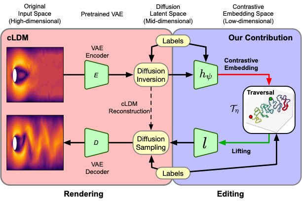

# Contrastive Diffusion Alignment: Learning Structured Latents for Controllable Generation

<p align="center">
  
</p>

## Installation
Clone the repository:
```bash 
git clone https://github.com/Grosenick-Lab-Cornell/ConDA.git
cd ConDA
```
Create the conda environment:
```bash 
conda env create -f embedding_env.yml
conda activate embedding_env
```
To recreate the environment file from an existing conda environment, use:
```bash 
conda env export -n embedding_env --no-builds | grep -v "^prefix:" > embedding_env.yml
```
## Datasets information
- We release the Flow Past a Cylinder benchmark dataset, available on Hugging Face at `ruchi-sandilya/Flow-Past-Cylinder`. It can be downloaded using:
```bash
hf download ruchi-sandilya/Flow-Past-Cylinder \
  --repo-type dataset \
  --local-dir ./data/flow_past_cylinder
```
We also provide details of the FEM simulations used to generate the Flow Past a Cylinder benchmark image and graph datasets in the following repository: https://github.com/ruchi-sandilya/Flow_past_a_cylinder_benchmark

- The two-photon calcium imaging data are available upon request from the authors of the original study (Spellman et al., 2021). 
- The DISFA dataset is available upon request through the official dataset website https://www.mohammadmahoor.com/pages/databases/disfa/. 
- The monkey reaching dataset, MC\_Maze, is publicly available at https://dandiarchive.org/dandiset/000128 (download using `dandi download DANDI:000128/0.220113.0400` in `data/monkey`)
- However, for E-Field simulation, we cannot provide the real patient neuroimaging data because these data are part of an ongoing clinical trial and are HIPAA-protected.

## Experiments
The experiments are organized by dataset/task. Each dataset-specific folder contains the scripts, notebooks, and supporting files needed to train the conditional latent diffusion model, generate diffusion latents, and evaluate ConDA-based interpolation, extrapolation, and baseline comparisons.
#### Experiment Folders
```text
cLDM_256x256_DISFA/
cLDM_256x256_calcium_imaging/
cLDM_256x256_fluid/
monkey_reach_neural_spiking/
```
The `cLDM_256x256_*` folders contain the main image-based experiments. The `monkey_reach_neural_spiking/` folder contains the neural-spiking experiment and related analysis notebook.

**1. Train the cLDM Model.** To train the conditional latent diffusion model, go to the corresponding experiment folder and run:

```bash
bash run_train.sh
```
For example:
```bash
cd cLDM_256x256_fluid
bash run_train.sh
```
The training script calls the relevant model, configuration, and utility files inside the dataset-specific folder. The reconstruction quality of the trained cLDM model can be evaluated using:
```text
cLDM_reconstruction.ipynb
```
This notebook can be used to visualize reconstructed samples and check whether the trained diffusion model produces reliable latent-space reconstructions before running ConDA-based analyses.

**2. Generate Diffusion Latents.** After training, or when using a pretrained diffusion model/checkpoint, generate diffusion latents using:
```bash
python diffusion_latents_generator.py
```
This script extracts diffusion-model latent representations that are used as inputs for ConDA alignment, interpolation, extrapolation, and downstream evaluation. 

**3. Linear vs. Nonlinear Interpolation.** We compare interpolation in both the original diffusion latent space and the learned ConDA/control space.
The relevant notebooks are:
```text
Diffusion_space_linear_vs_nonlinear_interpolations.ipynb
C_space_linear_vs_nonlinear_interpolations.ipynb
```
These notebooks evaluate whether nonlinear trajectories in the learned ConDA space produce more meaningful and system-consistent transitions compared with direct linear interpolation in diffusion latent space.

**4. Extrapolation.** n-step-ahead extrapolation experiments are performed in the corresponding extrapolation notebooks, for example:
```text
n-step_ahead_prediction_in_C_space.ipynb
```
These experiments evaluate whether the learned ConDA space supports forward prediction or extrapolation along structured latent trajectories.

**6. Baseline Comparisons.** Baseline comparisons are provided in the corresponding folders, such as:

```text
ablation/
cebra/
classification/
```
depending on the dataset folder. These experiments compare ConDA-based interpolation and prediction against baseline latent-space methods, ablations, and alternative representation-learning approaches.

**7. Monkey Reaching Neural-Spiking Experiment**
The monkey reaching experiment is organized separately under:
```text
monkey_reach_neural_spiking/
```
This folder contains the neural-spiking data-processing and analysis workflow, including configuration files, LDNS-related code, and the ConDA-space interpretability notebook:
```text
Interpretability_of_ConDA_space.ipynb
```
**Recommended Workflow:** A typical workflow is:

```bash
# 1. Go to a dataset-specific experiment folder
cd cLDM_256x256_fluid

# 2. Train the conditional latent diffusion model
bash run_train.sh

# 3. Generate diffusion latents
python diffusion_latents_generator.py

# 4. Run the interpolation, extrapolation,
#    and baseline notebooks inside the same folder
jupyter notebook
```
Please update paths inside the scripts and notebooks according to the local location of the dataset, checkpoints, and output directories.

## Citation
```
@inproceedings{sandilya2026conda,
	author = {Ruchi Sandilya and Sumaira Perez and Charles Lynch and Lindsay Victoria and Benjamin Zebley and Derrick Matthew Buchanan and Mahendra T. Bhati and Nolan Williams and Timothy J. Spellman and Faith M. Gunning and Conor Liston and Logan Grosenick},  
	title = {Contrastive Diffusion Alignment: Learning Structured Latents for Controllable Generation},  
	journal = {Forty-Third International Conference on Machine Learning},
	year = {2026}  
}
```
## Contact
For questions, please contact: Ruchi Sandilya, Grosenick Lab, Weill Cornell Medicine, Email: sar4018@med.cornell.edu

